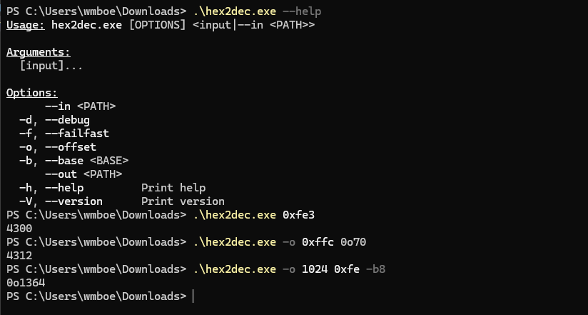

# HEX2DEC

hex2dec is a command-line application written in rust that provides base conversion and offset calculation tools for octal, decimal, and hexadecimal numbers.

This project is one part an exercise in project management (requirements-gathering, feature estimation, etc.) and one part granting me convenience when working on stack exploits for a Cybersecurity course I'm taking.

For more information, view the [Software Requirements](docs/Requirements.md).

Build it yourself with cargo, or download the [latest build](https://github.com/wmboeckman/hex2dec/releases/latest) from the releases page.