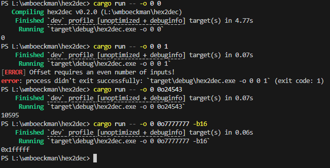

# Sprint 2 Reflection
#### Feb. 21st 2026

**Story Points Completed**: Basic Logging, Offset Calculation

## Summary

Logging and offsets took little time to get working initially, but ran into a lot of code duplication issues due to the way I initially chose to handle inputs. This required some refactoring, matching the inputs first to a common data type (Vec of Strings) and then processing further based on chosen cli options.

Logging was easy enough to set up, and was able to replace all of my initial debug statements and write useful warning and error responses. Right now, offsets are just the absolute value difference between two inputs, and can be further converted to any base type:

#### Bugfixes

- "0x" and any other lone prefix now returns an error message.
- Out-of-bounds errors with short inputs has been fixed.
- Decimal inputs that partially match a registered prefix (0) should now convert properly with file inputs.

### Known Bugs

- Very large numbers (>64bit) still fail in conversion (again, probably `usize`).
    - *I Might decide to let it fail, but throw a clear error message for very large numbers like this*

## Looking Forward

With all of the main features in place, I need expand on the unit tests to include offsets. Additionally, I plan on adding tests for the outer functions (conv2...), comparing them with the inner function's output.

The last sprint will be dedicated toward finishing all CLI file I/O operations, output color and formatting, as well as final integrations. 