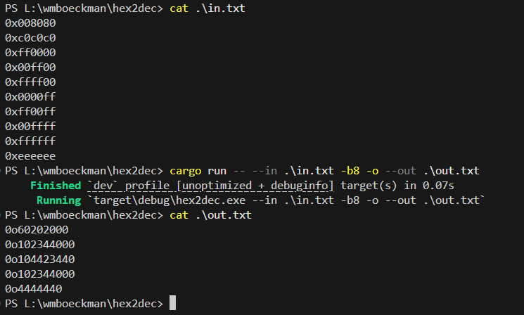

# Sprint 3 Reflection
#### Feb. 28th 2026

**Story Points Completed**: CLI file I/O, CLI color formatting

## Summary

Similar to a previous sprint, this one had less work than I had originally estimated. This was mostly due to the realization that I had missed a few constraints for the file IO user story, leading me to choose the easier implementation task of only handling small files.  

File IO operations have been reimplemented to load the entire file into memory if possible to do so. Initially, I wanted to use a buffered approach where the file is read in chunks of bytes, but this presented compatibility issues with how the cli input gets processed, and I was running up against my time limit for this sprint.

That all being said, file input and output works as expected for *reasonable* file sizes:

As for color output in the console, I have made an initial implementation for 10 or more lines of output:

#### Bugfixes

Very large numbers (for now) should now return a clean error.